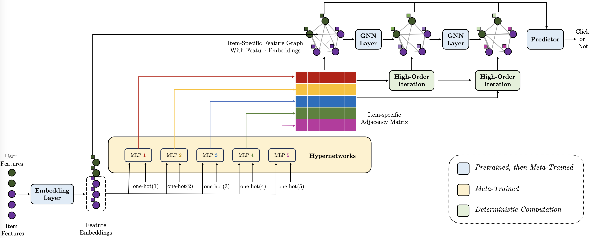

# EmerG

The source code for the KDD 2024 paper:\
**Warming Up Cold-Start CTR Prediction by Learning Item-Specific Feature Interactions**\
*Yaqing Wang, Hongming Piao, Daxiang Dong, Quanming Yao, Jingbo Zhou* \
The 30th ACM SIGKDD Conference on Knowledge Discovery and Data Mining (KDD ’24)

<p align="center">

</p>

## Abstract
In recommendation systems, new items are continuously introduced, initially lacking interaction records but gradually accumulating them over time. Accurately predicting the click-through rate (CTR) for these items is crucial for enhancing both revenue and user experience. While existing methods focus on enhancing item ID embeddings for new items within general CTR models, they tend to adopt a global feature interaction approach, often overshadowing new items with sparse data by those with abundant interactions. Addressing this, our work introduces EmerG, a novel approach
that warms up cold-start CTR prediction by learning item-specific feature interaction patterns. EmerG utilizes hypernetworks to generate an item-specific feature graph based on item characteristics, which is then processed by a Graph Neural Network (GNN). This GNN is specially tailored to provably capture feature interactions at any order through a customized message passing mechanism. We further design a meta learning strategy that optimizes parameters
of hypernetworks and GNN across various item CTR prediction
tasks, while only adjusting a minimal set of item-specific parameters within each task. This strategy effectively reduces the risk of overfitting when dealing with limited data. Extensive experiments on benchmark datasets validate that EmerG consistently performs the best given no, a few and sufficient instances of new items.

## Environment

python=3.9.0\
Please also refer to requirements.txt.

## Dataset
* Please use preprocess_ml100k.ipynb` to generate `movielens100K_data.pkl`. 
## Run
1. model_name：gnn
2. warmup_model：emerg
3. train and test
   * movielens100K:
     ```
     python main.py --dataset_name movielens1M --model_name gnn  --warmup_model emerg --item_id_name item_id --device cuda:0
     ```

## Codes
* `data` for dataset loading
* `datahub` for dataset and dataset preprocessing
* `model` for our model
* `main.py` for training and testing
